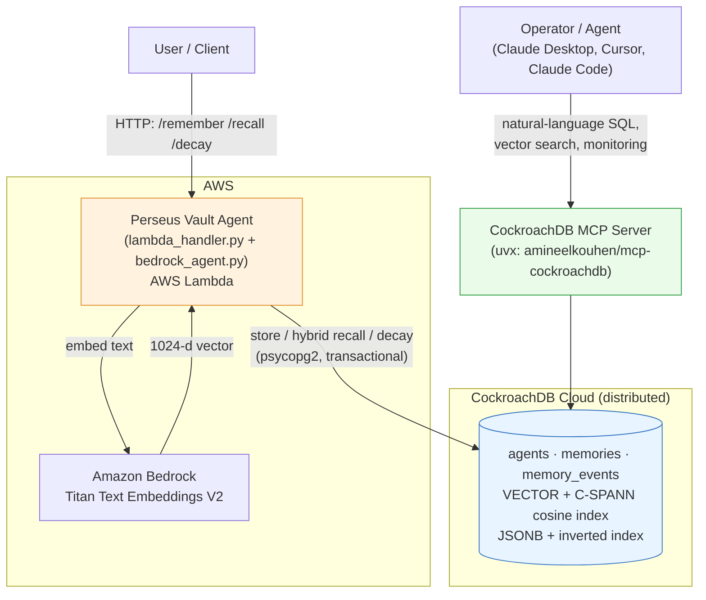

# Perseus Vault — Agentic Memory on CockroachDB

> An AI agent is only as good as what it can remember. Perseus Vault gives agents a
> **production-grade memory** — store, recall, reinforce, and decay — backed by
> CockroachDB's distributed SQL + vector index as a single transactional source of
> truth, embedded on Amazon Bedrock, and served from AWS Lambda.

Built for the **CockroachDB × AWS "Build with Agentic Memory" Hackathon (2026).**

## ▶️ Live demo

**[vault-demo.perseus.observer](https://vault-demo.perseus.observer)** — teach an agent
facts and recall them *by meaning* in your browser, backed by **real CockroachDB**.

- Genuine CockroachDB (single-node, same engine as CockroachDB Cloud) demonstrating the
  core idea on a focused single-table slice of the design: structured facts **and** a
  native `VECTOR` column in one distributed table, with the vector index enabled. (The
  full app uses the richer event-sourced schema + salience re-ranking described below.)
- Recall runs as in-database vector search (`ORDER BY embedding <-> query_vector`) —
  not a simulation.
- **Honest scope:** embeddings come from a small **local** model baked into the demo image
  (so it's keyless, free, and abuse-safe for public use); the production entry embeds on
  **Amazon Bedrock Titan v2**. Vectors are unit-normalized so `<->` ranks by cosine.
- Per-visitor sandbox, rate-limited, idle-reaped. Source + stack: [`webdemo/`](webdemo/)
  (`docker compose up -d --build`).

---

## 🧠 Agentic Memory Design (the core of this project)

Human memory isn't a dump of everything ever seen — it *ranks*, *reinforces*, and
*forgets*. Perseus Vault gives an agent the same three behaviors, and every one of
them is implemented against CockroachDB, not in a fragile in-process cache.

### 1. Recall ranking — relevance is more than cosine distance
A naive vector store returns the nearest embeddings and stops there. Perseus Vault
treats nearest-neighbor as a **candidate pool**, then re-ranks with a composite
salience score that mirrors how memory actually surfaces:

```
score = salience × ( 0.60·similarity  +  0.25·recency  +  0.15·frequency )
```

- **similarity** — `1 − cosine_distance` from CockroachDB's distributed vector index.
- **recency** — exponential decay with a configurable half-life (default 7 days).
- **frequency** — diminishing-returns boost from how often the memory has been recalled.
- **salience** — a per-memory weight that grows on use and shrinks with neglect.

So a slightly-less-similar fact that the agent relies on every day can rightly
out-rank a closer-but-stale one. (`vault_core.py → recall_memories`)

### 2. Cross-session persistence — memory outlives the process
Every memory is keyed to an **agent identity** (`agents` table) and lives in
CockroachDB. The agent runs on **AWS Lambda**, where each invocation is a fresh,
stateless execution environment. Because nothing is held in process, "the agent
remembers across sessions" is a real, demonstrable property — a memory written in
one Lambda invocation is recalled, ranked, and reinforced in the next, even after a
cold start. (`agents` + `memories` tables, `lambda_handler.py`)

### 3. Decay — forgetting is a feature
Unbounded memory becomes noise. A scheduled decay pass ages each memory's salience
by `exp(−rate × days_idle)`; anything that falls below a threshold is **archived**
(`decayed_at` set) and dropped from the active recall set — without deleting the
audit trail. Recall, meanwhile, **reinforces** the winners (salience + access-count
bump). Signal is kept alive by use; noise fades on its own.
(`vault_core.py → run_decay` / `_reinforce`, runnable via `decay.py`)

> Every store, recall, decay, and reinforce is written to an append-only
> `memory_events` table with a timestamp and score — so the memory's *behavior over
> time* is itself queryable and auditable.

**Maps to the judging criteria:**

| Judging criterion | Where it lives |
| --- | --- |
| **Agentic Memory Design** (primary) | Composite recall ranking, salience reinforcement, time-based decay, agent-scoped cross-session persistence, event-sourced memory log |
| **Technical Implementation** | Distributed CockroachDB vector search (C-SPANN cosine index), relational schema with FKs + JSONB + inverted index, CockroachDB MCP Server integration, Bedrock embeddings, Lambda-native deploy |
| **Real-World Impact** | Consistency-safe memory (no drift between structured state and vectors), horizontal scale, multi-region survivability, natural-language DB introspection for operators via MCP |

---

## 🏗️ Architecture



The **agent path** (Lambda → Bedrock → CockroachDB) and the **operator path**
(MCP client → CockroachDB MCP Server → same cluster) both hit one consistent store.

---

## 🗄️ Data model (relational, event-sourced)

Not a flat key-value table — a normalized schema with foreign keys, timestamped
events, and JSONB for flexible content. See `db_schema.py`.

- **`agents`** — `id`, `name` (unique), `created_at`. The persistence anchor.
- **`memories`** — `id`, `agent_id → agents (FK, cascade)`, `content`,
  `metadata JSONB` (inverted-indexed), `embedding VECTOR(dim)` (C-SPANN cosine
  index), `salience`, `access_count`, `created_at`, `last_accessed_at`, `decayed_at`.
- **`memory_events`** — append-only `store | recall | decay | reinforce` log with
  `memory_id`/`agent_id` FKs, `score`, and `occurred_at`.

Multi-region survivability (`REGIONAL BY ROW`, `SURVIVE REGION FAILURE`) is available
and documented in `db_schema.py → MULTI_REGION_SQL`.

---

## 🔌 CockroachDB MCP Server integration

The required [CockroachDB MCP Server](https://github.com/amineelkouhen/mcp-cockroachdb)
is wired to the **same cluster** the agent uses, giving operators and other agents a
natural-language interface for querying memories, running vector similarity searches,
and monitoring cluster health.

1. Install the [`uv`](https://docs.astral.sh/uv/) toolchain (provides `uvx`).
2. Fill in the `CRDB_*` vars in `.env` (see `.env.example`).
3. Verify the integration is launch-ready:
   ```bash
   python verify_mcp.py
   ```
4. Load `mcp_config.json` into your MCP client (Claude Desktop / Cursor / Claude Code).
   The client launches the server via:
   ```bash
   uvx --from git+https://github.com/amineelkouhen/mcp-cockroachdb.git cockroachdb-mcp-server
   ```

Now you can ask, in natural language, *"show the 5 most-recalled memories for agent
perseus-vault-demo-bedrock"* or *"run a cosine vector search against the memories
table"* — the MCP server translates it to SQL against the live cluster.

---

## 🚀 Setup

### Prerequisites
- Python 3.11+
- A [CockroachDB Cloud](https://cockroachlabs.cloud) cluster
- An AWS account with Amazon Bedrock (Titan Embeddings) + Lambda access
- [`uv`](https://docs.astral.sh/uv/) (for the CockroachDB MCP Server)

### 1. Install
```bash
git clone https://github.com/tcconnally/perseus-vault-hackathon
cd perseus-vault-hackathon
python -m venv venv && source venv/bin/activate   # Windows: venv\Scripts\activate
pip install -r requirements.txt
```

### 2. Configure
```bash
cp .env.example .env      # then fill in real values — .env is gitignored
```

### 3. Create the schema
```bash
python db_schema.py
```

### 4. Run the demo
```bash
python bedrock_agent.py   # store + hybrid recall via Amazon Bedrock
python decay.py           # run a decay/maintenance pass
python verify_mcp.py      # confirm the CockroachDB MCP Server is launch-ready
```

---

## 🌐 Usage (REST API)

Run locally (`python handler.py`) or deploy to Lambda. Endpoints:

```bash
# Store a memory with flexible JSONB metadata
curl -X POST $URL/remember -H 'Content-Type: application/json' \
  -d '{"content":"Project Phoenix deploys to AWS Lambda in us-east-1.",
       "metadata":{"project":"phoenix","type":"infra"}}'

# Recall — returns memories ranked by the composite salience score
curl -X POST $URL/recall -H 'Content-Type: application/json' \
  -d '{"query":"Where does Phoenix deploy?","top_k":3}'

# Run a decay pass (schedule via Amazon EventBridge)
curl -X POST $URL/decay

# Health + vault stats (active vs archived memory counts)
curl $URL/health
```

### Deploy to AWS Lambda
```bash
docker build -t perseus-vault .
# Push to Amazon ECR, create a Lambda from the container image, add a Function URL.
# Optional: EventBridge schedule -> Lambda to run decay.py periodically.
```

---

## 📦 Repo layout

| File | Role |
| --- | --- |
| `vault_core.py` | Provider-agnostic memory engine: hybrid recall ranking, reinforcement, decay |
| `bedrock_agent.py` | Amazon Bedrock embedding provider (primary AWS path) |
| `agent.py` | OpenAI embedding provider (fallback) |
| `db_schema.py` | Distributed CockroachDB relational schema |
| `decay.py` | Standalone decay/maintenance runner (schedulable) |
| `mcp_config.json` / `verify_mcp.py` | CockroachDB MCP Server wiring + preflight |
| `handler.py` / `lambda_handler.py` | Flask (local) and AWS Lambda entrypoints |
| `Dockerfile` / `Dockerfile.lambda` | Lambda container image |
| `docs/SUBMISSION.md` | Devpost submission copy |

## License
MIT — see [LICENSE](LICENSE).
