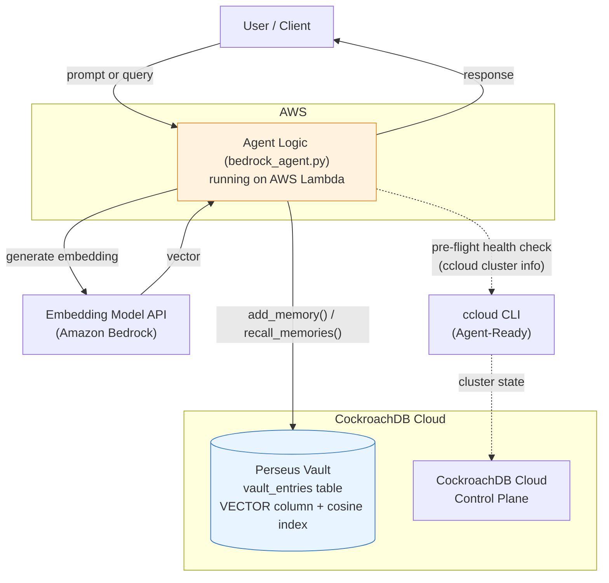

# Perseus-Vault: An Agentic Memory Core

> Perseus-Vault is an AI agent whose intelligence is only as good as its memory — so we gave it a
> production-grade one. Instead of bolting on a fragile, in-memory vector store, Perseus uses CockroachDB's
> distributed SQL and vector indexing as a single, consistent source of truth for everything the agent
> knows: facts, embeddings, and conversation state, all transactionally safe and built to survive
> real-world scale. Deployed as an AWS Lambda-backed agent, Perseus-Vault proves a simple thesis: an
> agent doesn't just need to think and act — it needs to *remember*, reliably.

Built for the CockroachDB × AWS Hackathon (2026).

## Table of Contents
- [Core Concepts](#core-concepts)
- [How It Works](#how-it-works)
- [Setup & Installation](#setup--installation)
- [Usage](#usage)
- [CockroachDB & AWS Tools Used](#cockroachdb--aws-tools-used)
- [License](#license)

## Core Concepts

*Why does reliable memory matter for AI agents?*

Most AI agents have a critical flaw: they're forgetful. Their "memory" is often just the context window of the current conversation, which vanishes the moment the session ends. For an agent to be more than a chatbot, to be a trustworthy partner in multi-step, long-running tasks, it needs a memory that persists.

Some agents attempt this by bolting on a standalone vector database. This is a step in the right direction, but it introduces a new problem: data inconsistency. The agent's structured knowledge and its semantic/vector memory now live in two different systems, which can drift out of sync and are not updated transactionally.

Perseus-Vault solves this by using CockroachDB as a single, unified system of record. Both the agent's state and its vector embeddings live in the same distributed, transactional database. This design provides:
- **Persistence:** Memory survives across sessions, reboots, and deployments.
- **Consistency:** Writes are atomic. The agent's understanding of the world is never left in a half-updated state.
- **Scalability:** CockroachDB's distributed architecture means the agent's memory can grow without hitting a single-node bottleneck.

## How It Works

The Perseus-Vault agent is a Python application designed to run as a serverless function on AWS Lambda. Every interaction is a stateless execution, forcing the agent to rely entirely on its externalized memory in CockroachDB.



The flow is as follows:
1.  A user's prompt invokes the AWS Lambda function.
2.  The agent logic in `bedrock_agent.py` receives the request.
3.  To recall information, the agent sends the query to Amazon Bedrock to generate an embedding. It then queries the `vault_entries` table in CockroachDB, using `ORDER BY embedding <-> query_vector` to find the most semantically similar memories.
4.  To add information, the agent first uses the `ccloud` CLI to run a health check against the cluster. If healthy, it generates an embedding for the new information via Bedrock and `INSERT`s the content and vector into the `vault_entries` table in a single atomic transaction.
5.  The agent formulates a response based on the recalled memories and returns it to the user.

### Tech Stack
- **Agent logic**: Python (`agent.py` for OpenAI, `bedrock_agent.py` for AWS Bedrock)
- **Memory layer**: Perseus Vault (custom) + CockroachDB (Distributed Vector Indexing, ccloud CLI)
- **Compute**: AWS Lambda
- **[Additional AWS services — TBD]**

## Setup & Installation

### Prerequisites
- Python 3.11+
- A CockroachDB Cloud account and cluster ([sign up](https://cockroachlabs.cloud))
- An AWS account with Lambda access
- `ccloud` CLI installed and authenticated

### 1. Clone the repository
```bash
git clone <repo-url>
cd perseus-vault
```

### 2. Create a virtual environment
```bash
python -m venv venv
source venv/bin/activate  # Windows: venv\Scripts\activate
```

### 3. Install dependencies
```bash
pip install -r requirements.txt
```

### 4. Configure environment variables
Create a `.env` file in the project root:
```
# For OpenAI version (agent.py)
# DATABASE_URL="postgresql://<user>:<password>@<host>:26257/<database>?sslmode=verify-full&sslrootcert=<path-to-ca.crt>"
# OPENAI_API_KEY="sk-..."
# EMBEDDING_DIMENSION=1536

# For AWS Bedrock version (bedrock_agent.py)
DATABASE_URL="postgresql://<user>:<password>@<host>:26257/<database>?sslmode=verify-full&sslrootcert=<path-to-ca.crt>"
AWS_REGION="us-east-1"
EMBEDDING_DIMENSION=1024

# Required for both
CCLOUD_CLUSTER_NAME="<your-cluster-name>"
```
You will also need to have your AWS credentials configured in your environment (e.g., via `~/.aws/credentials` or environment variables `AWS_ACCESS_KEY_ID`, `AWS_SECRET_ACCESS_KEY`).

### 5. Initialize the database schema
```bash
python db_schema.py
```

## Usage

### Running Locally

```bash
# Ensure your .env file is configured, then run the Bedrock variant:
python bedrock_agent.py
```

**Example output:**
```
--- STEP 1: ADDING MEMORY (BEDROCK) ---
Running health check on cluster 'my-cluster'...
Health check PASSED. Cluster is in CREATED state.
Generating embedding for: 'The primary contact for the Cerberus project is Dr. Aris Thorne.'
Successfully added new memory to the Perseus Vault.

--- STEP 2: RECALLING MEMORY (BEDROCK) ---
Recalling memories related to: 'Who is the main contact for project Cerberus?'

Top recalled memories:
  - [Content]: The primary contact for the Cerberus project is Dr. Aris Thorne. (Distance: 0.1234)
```

### Deploying to AWS Lambda

1. Build the Docker image:
   ```bash
   docker build -t perseus-vault .
   ```
2. Push to Amazon ECR and create a Lambda function using the container image.
3. Invoke the function to see persistent memory across stateless invocations.

## CockroachDB & AWS Tools Used

- **CockroachDB Distributed Vector Indexing** — The agent's memory table (`vault_entries`) stores each memory's text content alongside a vector embedding in a native `VECTOR` column, indexed with a cosine-similarity vector index (`VECTOR INDEX ... vector_cosine_ops`). When the agent needs to recall information, it embeds the incoming query and runs an `ORDER BY embedding <-> query_vector LIMIT k` search directly against CockroachDB — no separate vector database, and no consistency gap between the agent's operational data and its semantic memory.
- **ccloud CLI (Agent-Ready)** — Before committing a new memory to the database, the agent shells out to `ccloud cluster info` and checks that the cluster is reporting a healthy state before proceeding with the write. If the cluster isn't healthy, the agent logs a clear warning and skips the write rather than failing silently.
- **AWS Lambda** — Hosts the agent's core logic (`bedrock_agent.py`) as a serverless function. Every invocation is a fresh execution environment, which is precisely what makes the "memory survives across sessions" demo meaningful rather than trivial.
- **Amazon Bedrock** — The agent calls Titan Text Embeddings V2 (`amazon.titan-embed-text-v2:0`) via the `bedrock-runtime` Boto3 client to convert both stored memories and incoming queries into 1024-dimensional vectors before they're written to or queried from CockroachDB.

## License

MIT
